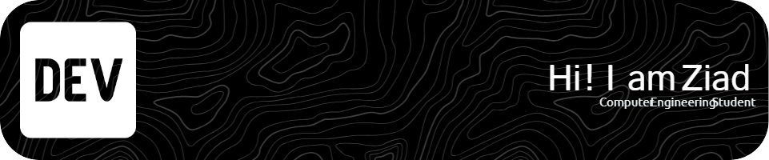

# Hi, I'm Ziad Elraggal! 👋

<!-- Replace the image below with your own banner -->

I'm a **Computer Engineering student** passionate about solving problems through code, building innovative projects, and learning new technologies. I enjoy working on both backend and frontend development, with a keen interest in **machine learning**, **data science**, and **software engineering**.

---

## 🛠️ **Technologies & Tools:**

<!-- Add the tools and languages you work with -->

---

## 📈 **GitHub Stats:**

  
  

<!-- Contributions Graph -->

  

---

## 🔍 **What I’m Currently Working On:**

- 🌱 Learning **Machine Learning** and **Deep Learning** with Python(Jupyter)
- 🚀 Building a fall detection appliation based on a machine learning model
- 🛠️ Developing a backend API for **chart generation** using FastAPI and Python
- 🤖 Experimenting with **React Native and Machine Learning**

---

## 🤝 **Connect with Me:**

  
  
  

---

## 📚 **Recent Projects:**

### 1. **HEART (Full-stack mobile application with a machine learning model)**  
- An innovative application designed for fall detection and emergency monitoring.  
- Connects seamlessly to a machine learning model to track status updates and send alerts.  
- Built with **React Native**, **FastAPI**, and **SafeStep ML model** integration.
- [Website Link](https://ziadelraggal.github.io/ziadelraggal.github.io-HEART/) 
- *In Progress! Come back soon!*  

### 2. **Personal Portfolio Website**
   - A Website with animations to showcase my skills.
   - Developed using **React.js**, **TypeScript**
   - [Project Link](https://ziadelraggal.github.io/ziadelraggal.github.io-main/)

   ### 3. **Data Recording, Visualization & Analysis Tool**
   - A MATLAB based software that works with Keithley multimeters for data recording and visualization.
   - Developed using **MATLAB**
   - [Project Link](https://github.com/ZiadElraggal/Project_Keithley)

---

  <i>Let's create something awesome together!</i>

